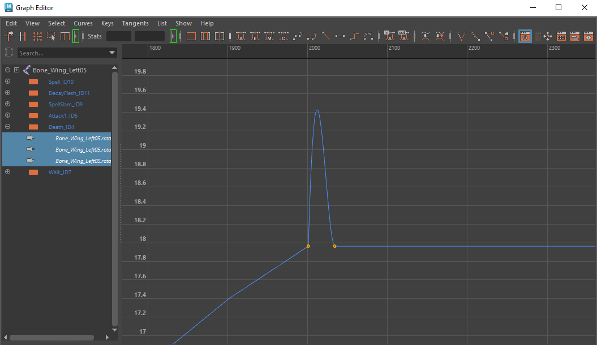

# Autodesk Maya MDX Plugin
Plugin for Autodesk Maya, using .NET API and MEL API, able to import Warcraft 3 MDX800 (classic) models. Magos' MdxLib using as parser. Currently supports mesh import, rig, joint animations, and texture loading.

Plugin adds file translator and four MEL commands for setting up texture loading to Maya.

Made and tested for Autodesk Maya 2024.

# Installation
1. Copy **wc3ToMaya.nll.dll** and **MdxLib.dll** to binary plug-ins directory. For example **C:\Program Files\Autodesk\Maya2024\bin\plug-ins**.
2. Find **wc3ToMaya.nll.dll** in Plug-in Manager and set checkboxes.

3. *Optional*. If you need automatic loading of textures, then use the MEL command **"wc3_setAssetDir;"** in the script editor, then select the root directory of the unpacked Warcraft. The following formats are available: .dds, .tga, .png, .tif, .tiff, .bmp, .jpg, .jpeg.
4. *Optional*. If you need to convert .blp textures while importing, then integration with *Retera Model Studio 04.4k+* is possible. Use the MEL command **"wc3_setCLIApp;"**, then select ReteraModelStudio.exe. After this, the blp textures will be automatically converted to png (new file will be created near).

# Importing

Use File -> Import -> Warcraft MDX option. Model will be loaded into scene in a couple of seconds.

Currently supports mesh data (vertices, faces, normals, uv, skin data), rig data (bones and helpers presented as joints, rig hierarchy), animations data (translate, rotate and scale of joints except Global sequences).

Other types of nodes except for bones and helpers are not supported. Geoset animations, material animations, cameras and lights are also not supported; all this is ignored. 

Plugin automatically creates a Lambert shader for single-layer materials, and a Layered shader for multi-layer materials.

Textures with a path to the file are supported; among procedural/dynamic textures (ReplaceableId), only Team Color (ReplaceableId 1) is supported, others are ignored. Plugin creates File Node for every non-replaceable texture.

Team Color is implemented as a Layered shader, with a custom color on the second layer.

# Clips Navigation

Plugin will create a track and clip for each sequence (except global sequences) in the *Time Editor*. Current animation can be specify with Solo Track and Mute Track functions. Immediately after import animation with id 0 will start playing.

# Known Issues

- Enabled *Echo All Commands* option in the Script Editor can slow import process, since plugin uses a huge number of MEL commands (almost everything related to rigging, skinning and animations).
- Very rarely, a bug is possible when an incorrect texture file is applied to mesh. Solution: reimport model.
- Plugin imports animations with a default *Spline* controller, OR with a *Linear* controller if it is used in Warcraft model. 3DSMax TCB controller (the most common case in Blizzard models) is not supported in Maya. *InTan and OutTan values are ignoring.*
- In addition to the point above, it should be noted that due to peculiarities interpolation of quaternions in Maya, unexpected spikes may appear in curves between nearby frames. Like the picture below. The plugin does not correct these artifacts. The easiest way to avoid it is to use a *Linear* controller instead of a *Spline* one.

